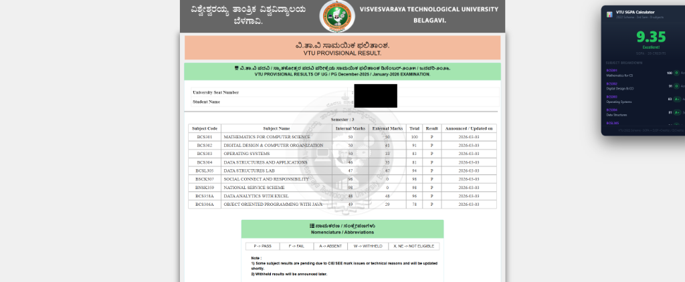
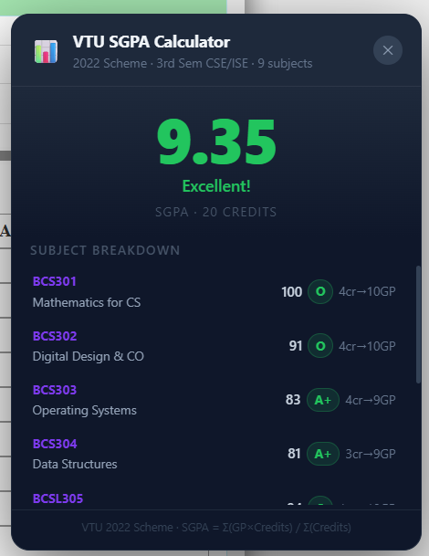

# 📊 VTU SGPA Calculator — Chrome Extension

Instantly calculates your SGPA when you view your results on the VTU results page. No manual entry needed — it reads marks directly from the page.

## ✨ Features

- **Auto-detects** subjects, marks, and credits from the results table
- **Calculates SGPA** using the official VTU grading scale
- **Per-subject breakdown** with grades and grade points
- **Draggable widget** — move it anywhere on the page
- Supports **multiple semesters** (auto-detects which semester)
- Works with both **CSE and ISE** branches

## 📥 Installation

1. **Download** — Click the green **Code** button above → **Download ZIP**
2. **Unzip** the downloaded folder
3. Open **Chrome** and go to `chrome://extensions`
4. Turn on **Developer mode** (top-right toggle)
5. Click **Load unpacked** and select the unzipped folder
6. ✅ Done! Visit [results.vtu.ac.in](https://results.vtu.ac.in) and the widget appears automatically

## 📋 VTU Grading Scale

| Marks | Grade | Grade Point |
|-------|-------|-------------|
| 90–100 | O | 10 |
| 80–89 | A+ | 9 |
| 70–79 | A | 8 |
| 60–69 | B+ | 7 |
| 55–59 | B | 6 |
| 50–54 | C | 5 |
| 40–49 | P | 4 |
| < 40 | F | 0 |

**SGPA = Σ(GP × Credits) / Σ(Credits)**

## 🛠 Supported Semesters

- 3rd Sem CSE/ISE
- 7th Sem CSE/ISE

> More semesters can be added easily — just update the credit map in `content.js`.
